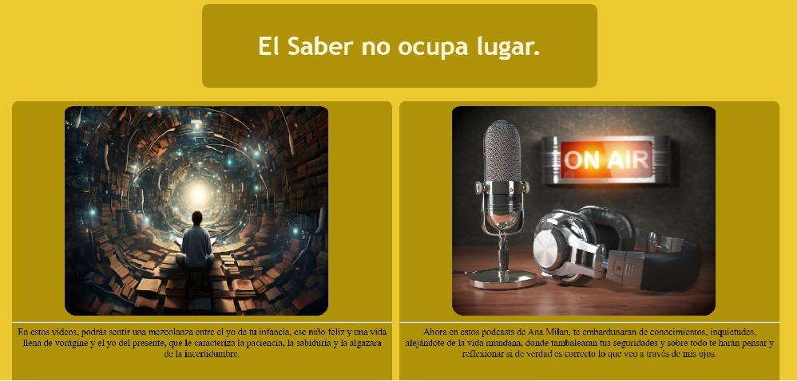

# Galeria Chachi  
En este trabajo de la asignatura de Lenguaje de Marca, creado con el Visual Studio Code, quería hacer una mezcolanza del conocimiento de antaño con el conocimiento de hogaño. Para hacer mención de antaño, he utilizado autores y obras antiguas de las famosas como:

* Abenámar y el Rey Don Juan. Anónimo.
* Don Quijote de la Mancha. Miguel de Cervantes.
* Canto a Andalucía. Anotnio Machado.

En el caso contrario, para homenajear la cultura de hogaño he hecho mención de la actric y presentadora __Ana Milán__, la cual mediante unos potcads nos hace reflexionar sobre la vida y el modo que tenemos de entenderla, al igual que el uso que le damos.

1. Clavo que saca otro clavo, vive en hueco ajeno.
2. He llorado por personas que no me acuerdo de su nombre.
3. ¿Cómo dejar de ser un folio liso?

## En esta tabla observamos, como el paso del tiempo ha dejado huella en nuestro lenguaje y en la forma de expresión de los viandantes. 

| Antaño / Videos   | Hogaño / Potcads   |
|-------------------|----------------------|
| Yo te agradezco, Abenamar aquesta tu cortesia.| En los momentos duros, darme mi timepo. |
| Frisaba la edad de nuestro hidalgo con los 50.| Dale like.   |
| Granada, agua oculta que llora.| El tequila del día a día |

## El diseño de la página web.

Hemos utilizado un color amarillo suave, para llamar la atención de nuestra página con respecto al recto, del mimo modo la hemos combinado con otro tono de amarillo más oscuro para crear las viñetas, las cuales tiene un buen contrate con las imágenes, poseen un fondo oscuro y eso hace que de manera visual sea agradable a la vez que llamativo.

## Descripción de la página de videos.
En esta página podemos observar tres videos en vertical, donde se muestra de forma visual y dinámica con ilustraciones y viñetas, los distintos tipos de relatos, que se hace mención  en la página.

[ Página de Videos.](galeria_chachi/galeria_video2.html)

## Descrición de la página de podcats.

En la siguiente página podemos observar, dos podcats de la actriz Ana Milán, donde nos dan varios consejos del día a día y el último son las palabras que les dedica a sus amigos, a la hora de recoger un premio de la academia de cine. En el lado derecho de la página encontramos un foto de la actriz y una breve biografía de la misma. 

[ Página de Podcats.](galeria_chachi/galeria_video3.html)

